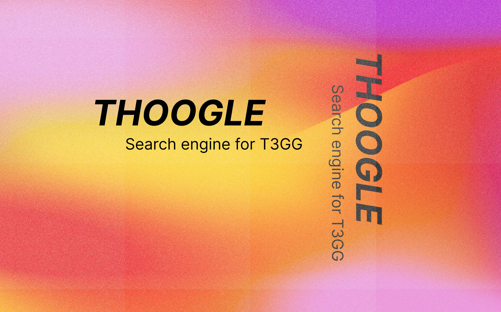

  

Thoogle is a search engine that also answers questions in the style of [Theo](https://twitter.com/t3dotgg). This leverages [operand](https://operand.ai/) to [index](https://operand.ai/indexes/dhlbkvmc7gue) all of Theo's videos and live-stream vods.

⚠️ Unfortunately operand has shut down so this project will no longer work. But here are a couple of funny examples from when it did:

